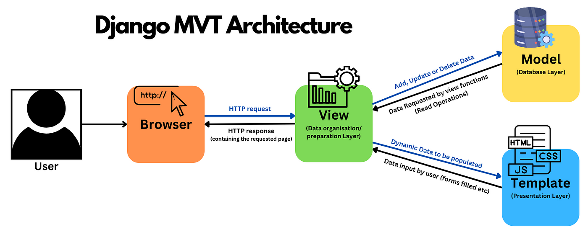

# Jaya Currency Converter

## Purpose

This project is part of Jaya's hiring process. It aims to show off my skill in a web application backend using Python and related technologies.

## Features

This project is an API that, given a request, will convert a value between two currencies.
Also, it provides another endpoint that allows the API user to fetch its conversions.
There's no actual authentication, except for checking if the user trying to use the API is registered.

## Techs used and its motivations

Below you can see the main technologies used in this project and why I have chosen it.

### SQLite

Despite the misconception of common sense, SQLite is a pretty capable database for production. It:
- Doesn't require any configuration. It needs no (or almost no) setup or administration.
- Can manage low to medium-traffic HTTP requests.
- is being used on [the edge](https://turso.tech/blog/why-sqlite-is-so-great-for-the-edge-ee00a3a9a55f).
- bypasses all the costs incurred by the network, layers of serialization and deserialization, authentication, authorization, and more.
- [N+1 Queries Are Not A Problem With SQLite](https://www.sqlite.org/np1queryprob.html)
- And [more](https://www.sqlite.org/whentouse.html)

Not to mention the obvious advantage: it's easy to start during the development.

### Django

Django is probably the top 3 Python web frameworks in the community (together with FastAPI and Flask). It's well known by its large community, plenty of resources available only, strong foundation behind it, and, of course, its batteries included, like its ORM - also I picked it up to show off my skills with it :D.

#### Django Rest Framework (DRF)

Like Django, DRF is, by far, the most used Django "library" to build REST APIs. It has all the features needed to build, maintain, test, and document APIs, like:

- The Web browsable API.
- Authentication policies including packages for OAuth1a and OAuth2.
- Serialization that supports both ORM and non-ORM data sources.
- Regular function-based views or class-based views.
- Routers, Caching, Throttling, Versioning, [among others](https://www.django-rest-framework.org/).

##### DRF-Spectacular

[DRF-Spectacular](https://drf-spectacular.readthedocs.io/en/latest/) is an extension that works together with DRF to generate OpenAPI (OAS) documentation for APIs.
It works out of the box, but it can be extended and customized. It provides two types of optional UI: Swagger-UI and Redoc.

### Redis

[Redis](https://redis.io/) is an in-memory database that can be used for caching. Among the many different cache backends that Django supports, I picked up Redis because is the one that I have most used in the past. It's easy to install and it can be used immediately without any configuration (for basic usage).

### Docker

[Docker](https://www.docker.com/) is an open source virtualization technology that makes it easy to build, test, and deploy applications. Most importantly, it makes the developer's life easier by making its application portable and consistent - no more "it works in my machine" (at least, in theory 🤷🏻‍♂️). Also, bringing together different resources into a single (or just a few) file(s) such as a database and/or Redis, makes the development much simpler.

## Layers, model and way of thought

The well-known Django's MVT architecture is shown below.



Since this is a REST API project, we don't use the template layer (or the presentation layer).
About the other layers, however, like I've seen in many projects in the past and how I have been trying to do and introduce in the projects that I'm part of, the approach here diverges a little bit from that architecture.

Here's how I scratch the model (don't confuse it with Djang's ORM models) of this project's domain:


**The relationship between User and Conversion** is pretty straightforward: a user may have zero or many conversions.

A **Conversion** is a complete response to the user after a successful conversion.

**ConversionRequest** and **ConversionResposes** are object values (or whatever name you want to call them) that move in and out in the process of making a conversion request and building a complete conversion response.

My step further is the services, which I (and I believe this is a very used strategy) commonly move to their modules, geniusly called "services.py" :D - this also moves away the business rules from the Views.

My idea was to completely decouple them from everything else, even though that would bring me the obvious trade-off of having more code to write and therefore more code to maintain.

However, today we're using [exchangeratesapi.io](https://exchangeratesapi.io/) as a third-party service to get the rates and convert values between currencies. If we wanted to add a new third-party service or even replace it, we would need almost zero code change, except for creating a new class that implements **ConversionRatesProtocol**.

The same idea was brought to caching. Since the free version, a requirement for this project has a limit of 200 requests per month, **I decided** to create a wrapper over Django's cache layer called **MidnightCache**. This implementation sets a key's time expiration automatically to the current day's midnight. Hence, the user of this project will always use a single set of rates for the entire day, even if they are changing through the day - just to save our quota.

That's likely not feasible for any production external service or user that wants to use this API, so one can create another cache implementation that implements **CacheProtocol** and nothing else changes in the entire codebase.

The gains immediate gains are:
- Decoupling
- Dependency inversion
- Testability

The drawbacks:
- More code to write
- The line is blurry on when to use or not this approach, especially using an opinionated framework like Django

On the latter point about drawbacks, I must mention **ConversionRepo**. If you take a look, I didn't follow the same approach as above because of Django's ORM. The ORM, in my mind, already does the job of making transparent changes like database types and reading and writing data. It's like **ConversionRepo** would be my database service and the ORM is my protocol - regardless of any change below it, it will continue to work as before to **ConversionRepo**.


## How to use and run it

First things first: you should get an API_KEY from [exchangeratesapi.io](https://exchangeratesapi.io/). After that, create a `.env` file with that value, like below:
```
EXCHANGE_API_KEY=<your_api_key>
```
Also include the Django's `SECRET_KEY` that can be generated/grabbed [here](https://djecrety.ir/); `Debug`, being `true` to development and `false` to production; and `ALLOWED_HOSTS` that can be set to `"*"` to run locally and to the proper domain when deployed remotely.

Your `.env` file will look like below (for local development):

```
EXCHANGE_API_KEY=<your_api_key>
SECRET_KEY=<your_secret_key_between_quotes>
DEBUG=true
ALLOWED_HOSTS="*"
```

After the above, install Docker and use docker-compose to build and run the project:
```
docker-compose up --build
```

Bash into the `web` container and create a superuser:

```
$ cd currency_converter
$ python manage.py createsuperuser
```
Once created, go to http://0.0.0.0:8000/admin/ and login. 

Using this superuser, you will create users that are going to be able to use this API. I followed this approach just for simplicity. In a real-world application, I would use regular authentication or even API_KEYS like the third party that we're using.

With the users created, you will see in the list of user, the collum `user_id`. Use it in the payload to POST to `api/conversions` to create a new conversion.

For the API documentation, just access http://0.0.0.0:8000/. 
